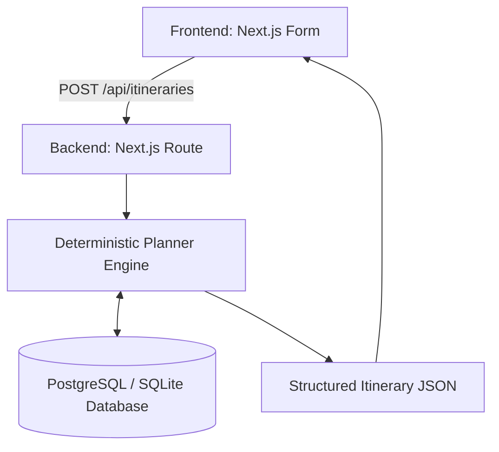

# Travel Itinerary Planner

## 1. Overview
WishTrip is an intelligent, full-stack travel itinerary planner. It takes user preferences—such as interests, budget, pace, and party size—and deterministically generates a practical, day-by-day itinerary.

## 2. Problem
Planning a trip is often overwhelming. Standard LLM models can generate itineraries but frequently hallucinate non-existent places, ignore geography, schedule overlapping activities, or disregard constraints like opening hours. This project solves this by using a deterministic planning engine backed by a relational database, optionally using AI only for natural-language explanations, guaranteeing factual and physically possible itineraries.

## 3. Features
- **Structured Trip Collection:** Detailed user preferences including pace, interests, and budget.
- **Relational Data Model:** Real-world constraints (opening hours, categories, locations) stored in a structured database.
- **Deterministic Planning (Upcoming):** A robust engine to filter, score, and allocate activities.
- **API-First Design:** A clear JSON API returning structured itineraries.

## 4. Architecture

- **Frontend**: Responsible for collecting inputs and rendering the final schedule.
- **API**: Validates input and orchestrates the planning.
- **Planner (Step 2)**: Core logic for filtering, scoring, and constraint checking.
- **Database**: Source of truth for all destinations and places.

## 5. Tech Stack
- **Next.js (App Router)** — Provides a unified, type-safe full-stack environment that's easy to deploy and reason about.
- **TypeScript** — Enforces type safety across API boundaries and planner logic.
- **Tailwind CSS** — Allows rapid UI prototyping.
- **Prisma** — Provides a type-safe ORM for relational data queries.
- **PostgreSQL** — Relational database providing strong schema enforcement and native Enums, running locally via Docker.
- **Zod** — End-to-end type validation for both the frontend form and API inputs.

## 6. Data Model
- **Destination**: E.g., Tokyo.
- **Place**: Attractions, restaurants, parks. Includes `category`, `latitude`, `longitude`, `defaultDurationMinutes`, `estimatedCost`.
- **PlaceOpeningHours**: Daily open/close times to validate scheduling constraints.
- **Interest** / **PlaceInterest**: Many-to-many relationship for matching user preferences to places.
- **TravellerType** / **PlaceTravellerType**: Many-to-many for checking suitability (e.g., family vs solo).

## 7. Data Sources
- **Dataset**: A manually curated subset of popular places in Tokyo, Japan.
- **Coordinates & Times**: Approximated and manually entered for the prototype to demonstrate constraint handling. They represent realistic data but are not live or exhaustive.

## Engineering Decisions & Trade-offs

### Decision: Mocked API Response in Step 1
- **Why**: To establish the API contract and verify end-to-end connectivity before writing complex planning logic.
- **Alternatives**: Building the planner immediately.
- **Trade-off**: The app currently returns a static response regardless of input.

## Running Locally

1. Install dependencies:
```bash
npm install
```
2. Start the local PostgreSQL database using Docker:
```bash
docker-compose up -d
```
3. Initialize database and run seed script:
```bash
npx prisma db push
npx prisma generate
npx prisma db seed
```
*(Note: If `npm run prisma:seed` fails, you can run `npx ts-node --compiler-options "{\"module\":\"CommonJS\"}" prisma/seed.ts`)*

3. Start development server:
```bash
npm run dev
```
